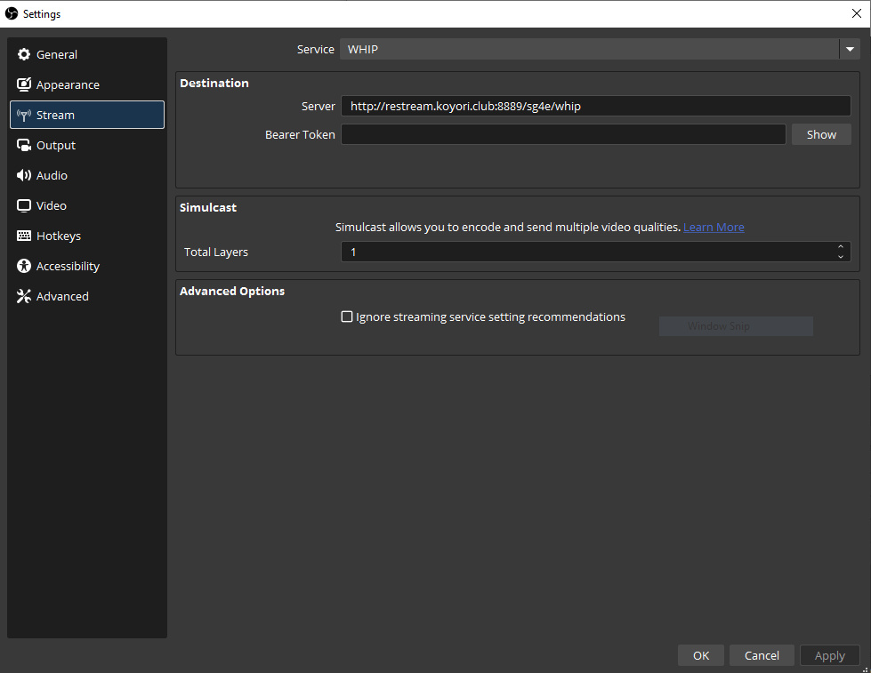
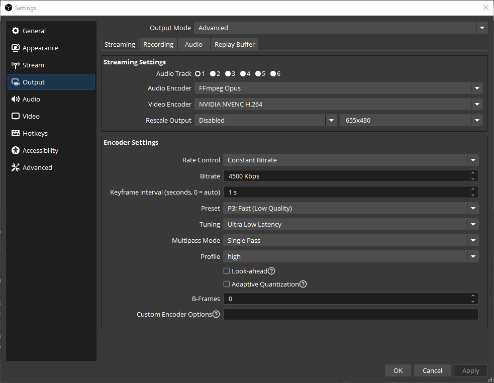

# Restream Server Ansible Playbook

This Ansible playbook sets up a ready-to-go [mediamtx](https://github.com/bluenviron/mediamtx) server on an OpenStack-compatible cloud service provider.

This playbook has been tailored to [DreamCompute](https://www.dreamhost.com/cloud/computing/) as the cloud service provider but can be adapted to any provider.

## Prerequisites

1. A Unix machine (or Windows WSL) for the Ansible control node. See the official guide for [Installing Ansible](https://docs.ansible.com/projects/ansible/latest/installation_guide/intro_installation.html).

2. A [DreamCompute](https://www.dreamhost.com/cloud/computing/) account.

3. A domain name.

## How to deploy

1. Clone this repository with git.

2. Edit `clouds.yaml.example` with your DreamCompute account information. Your information can be easily found inside the file downloaded from your DreamCompute console at `Project > Compute > API Access > Download OpenStack RC File v3`. After editing, move `clouds.yaml.example` to `~/.config/openstack/clouds.yaml`.

3. Create an SSH key in the DreamCompute console by going to `Project > Compute > Key Pairs > Create Key Pair`. Name it `deploy`. Download the private key and move it to `~/.ssh/deploy.pem`. Change the permissions on it with `chmod 600 ~/.ssh/deploy.pem`. This step is **not optional**.

4. If you'd like to allow SSH access to the server with additional keys, place the public keys inside `ssh_keys` in this project's root.

5. Edit `restream_playbook.yml` and replace the `domain` value with your hostname.

6. Optionally, replace the `bazaar_streams` values with whatever streams you'd like featured on the `bazaar.html` multistream grid page.

7. Use `cd` to enter the root of this project's directory and run `ansible-playbook restream_playbook.yml`.

8. Update your domain registrar's DNS record with the IP of the newly created server.

## How to stream

MediaMTX supports many ingress protocols and codecs. You can choose any codec as long as it's supported by WebRTC. The WHIP protocol with H.264 for video and Opus for audio is recommended. You **must** disable B-frames in your OBS settings.

Here's an example configuration in OBS. Replace `restream.koyori.club` with your domain and `sg4e` with the stream path you'd like to stream to (see below for how to watch from that path).

## How to watch

Visit `http://<YOUR DOMAIN>/?stream=<STREAM PATH>`. You can pop out multiple streams in picture-in-picture mode with some browsers like Firefox.

Visit `http://<YOUR DOMAIN>/bazaar.html` for a preconfigured multiview of selected streams.

Vods can be downloaded from `http://<YOUR DOMAIN>/vods/`. The vod retention policy can be adjusted in the `mediamtx.yml.j2` file.
